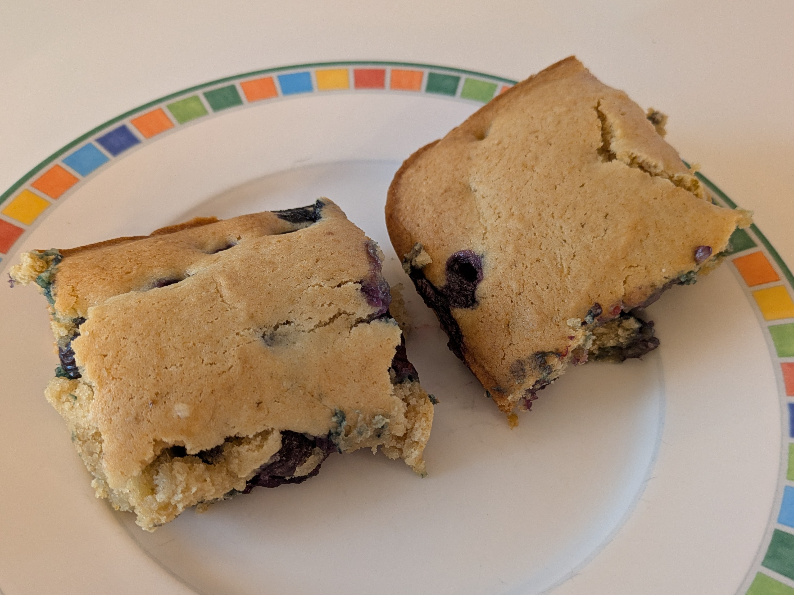

Title: Blueberry Cake
Date: 2026-01-01 11:40:00
Category: Desserts
Tags: cake, nut-free

{: .image-process-article-image}

I (Jamie) am not a cookbook author who can usually talk much about how a given recipe connects to my culture, or to my family history. As a white american, I don't really have much culture to call my own -- my ancestors came from many different parts of Europe, and no one really kept track of where or when (at least, in a way that survived till now). Plus, my mom (who is probably the biggest influence on my food) has quite international taste, so tacos, spaghetti, stir fry, and Pad Thai were all normal home-cooked meals that I grew up eating. I suppose I really am a good example of the classical american melting pot, where many different cultures and their cuisines get cooked down and mixed together and turn into something new. I don't think it's good or bad, but it's how I am, and I can't help but be honest about it.

But, not today! This is the one recipe that actually DOES come from my own family history! My dad's dad's mom ran a bed and breakfast in Waterville, Maine, and was known for her ability to cook meals for tens of people with ease (I like to think I inherited this, at least a little bit). My dad made the effort to write down a few of her best recipes, and this blueberry cake is one of them! He remembers being sent out to pick wild blueberries as a kid so that she could make this recipe.

 This dish is kind of like blondies, except that instead of nuts and chocolate chips, you just have blueberries and vanilla. It's not complicated, but if you like those flavors, you will find a lot to enjoy here. Both me and my dad grew up eating it it, and I can attest that not only is it nostalgic, it's also delicious!  I have, of course, converted this recipe to be vegan (doing a simple 1:1 conversion with vegan butter and egg replacer) and also rewritten it to include masses and be a little more descriptive. Hopefully my great grandma wouldn't be *too* angry that I messed with her creation, but honestly, if she's anything like me, I think she'd be happy to see it still being made!

## Yield
1 cake (about 12 pieces)

## Ingredients
- 1 cup blueberries
- 1 stick (113g) vegan butter, e.g. Earth Balance or Miyokos
- 1 cup (195g) white sugar
- 2 tbsp egg replacer (e.g. [Bob's Red Mill](https://www.amazon.com/Bobs-Red-Mill-Gluten-Replacer/dp/B01LZZUP98?th=1) brand)
- 0.25 cup warm water
- 0.5 cup plant-based milk (e.g. oat milk)
- 2 cups (240g) all-purpose flour, sifted (plus 1tbsp more for dusting)
- 2 tsp baking powder
- 0.25 tsp salt
- 1 tsp vanilla

## Time:
Mixing: ~20min

Baking: ~30min

## Procedure:

1. Preheat oven to 375°F
2. Wash the blueberries and lay them out on a paper towel to dry
3. Add the butter and sugar to a medium mixing bowl and cream them by beating rapidly for several minutes (you can use an electric mixer to make this easier).
4. Combine the egg replacer with the water in a bowl and mix with a fork or small spatula. Then add the egg replacer mixture to the mixing bowl and beat for another minute or two
5. Add plant-based milk, sifted all-purpose flour, baking powder, salt, and vanilla to the mixing bowl. Beat the mixture for another minute.
6. Add the dry blueberries to a small mixing bowl (pat carefully with paper towels if not fully dry). Then add 1tbsp of flour and mix in so that the berries are dusted with flour. This keeps them from sinking to the bottom of the cake when cooking.
7. Fold the berries carefully into the batter.
8. Grease a cake pan. You can use a 9"x9" pan for a thicker cake, or a 9"x13" pan for thinner, larger pieces.
9. Bake until the top of the cake is golden and a cake tester put into the center comes out clean. I'd start by baking for 25 minutes, then test every 5 minutes to see if it's done.

