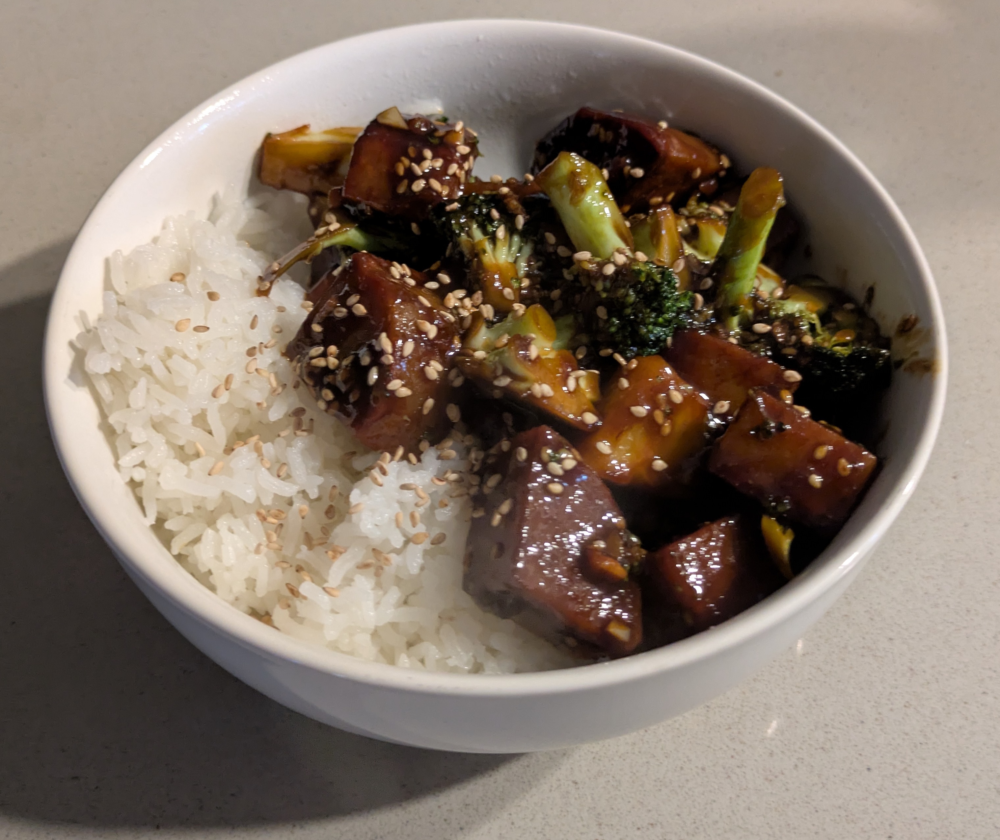

Title: Ginger Sesame Glazed Chunks
Date: 2025-09-15
Category: Main Dishes
Tags: stir-fry, gluten-free-option, nut-free

{: .image-process-article-image}

I've always thought of toasted sesame oil as a dangerous ingredient.  It has such a strong flavor that it can easily overpower the other tastes in a dish, and I don't think I've ever used more than a teaspoon at a time -- until I found the original version of this recipe in Nisha Melvani's cookbook _Practically Vegan_, which uses... two tablespoons!  And yet, it really works, because the sesame oil is counterbalanced by strong sweet and savory flavors from soy sauce, maple syrup, ginger, and rice vinegar. This recipe successfully emulates the delicious glazed sesame tofu I've had at restaurants before, and solidly earned a place in my regular rotation.

I'm republishing my own version here because I have figured out some modifications to make this dish even better, including adding broccoli and rice and making the sauce ingredients simpler. I also want to make it "generic" enough that you can use whatever fake meat (or other "chunk") you want, including soy chunks, fake chicken, or tofu. People tend to have different preferences about this and this recipe has enough flavor to make any of these options easily work!

## Yield:
About 3-4 full meals

## Time:
Approximately 60-90 minutes total.

## Ingredients:

- 1 cup dry white rice (if you have a zojirushi rice maker, that's about 1.5 of the cups it comes with)

**Fake Meat:**

You have several options here, including:

- 8oz [soy curls](https://www.amazon.com/BUTLER-FOODS-Soy-Curls-OZ/dp/B0048OBT04?th=1), rehydrated in warm water for 10 minutes and then drained.
    - This is what Nisha used in her original recipe. These curls are relatively light and crunchy, but some of my beta testers found their texture too unrealistic.
- 24 oz fake chicken of choice, cut into strips
    - There are a variety of options for this, both homemade and storebought. I tend to use [this recipe](https://fullofplants.com/the-best-vegan-chickn/), for which a single batch is just enough for this dish.
    - If you do go with storebought, make sure to get something unseasoned, so its flavors don't conflict with the seasoning in this recipe. I love Tofurkey's chicken strips but they will not work here.
- 2 blocks (28 oz) extra-firm tofu, pressed
    - If you want these to have more of a skin, you can optionally use the frying procedure described under [Restaurant Style Eggplant Tofu](Restaurant%20Style%20Eggplant%20Tofu.md) instead of the pan frying steps in this recipe
- 3 blocks (24 oz) tempeh

Whichever fake meat "chunk" you use, cut it into strips, approx. 1cm x 1cm x 3cm or 1/3" x 1/3" x 1".

**Pan-Fried Chunks:**

- 1 tbsp cornstarch
- 0.75 tsp salt
- Neutral cooking oil for pan-frying, around 2-3 tbsp

**Stir Fry:**

- 1 head broccoli, chopped (with stem as long as you like the stem)
- Neutral cooking oil, around 1 tbsp
- 5 garlic cloves, minced
- 2 tsp ginger, minced
    - Pro tip: you can store remaining ginger in the freezer, then re-microwave it next time you need it, and it doesn't lose its flavor!

**Sauce:**

- 2 tbsp Chinese light soy sauce (I recommend [Pearl River Bridge](https://www.amazon.com/Pearl-River-Bridge-Bottle-Superior/dp/B07PGWZCT6?crid=2NJOOT6Y9ZI1C&dib=eyJ2IjoiMSJ9.g2vlZTl10wZFaszcGY_sWlFMLgbwuZ9AXIBj-4nd3vJylQahbPV_1gcYBAklBH6_8o-iheDSxnpxudmKXzKHcXgwymwzxGGqqcpxjjjAx9SyfZB7w0Y9W0zEgx-zZQGKmF6Zn1CKqSbOuIQorXtJHjNdxTi57WPweNSnhnyamLHrmW49GH-jyydL9TohO6KRbqhMIuaY74xr6lSW7JXAMgFy94Ab0O1Yy1wEapmhpkmXuNDfIehIi9swtlAKbVMwFW1aZhv2Wn6Jjetqrb7ct38M3-RN_XCRm6Eo7dVCxDE.Gtv79NCpWAzLktQCxovZ5piKCUtJtrwrRK6P4cmhXGw&dib_tag=se&keywords=pearl+river+bridge+light+soy+sauce&qid=1732653233&sprefix=pearl+river+%2Caps%2C173&sr=8-2) brand #notsponsored)
- 1 tbsp dark soy sauce (e.g [this kind](https://www.amazon.com/Pearl-River-Bridge-Superior-Sauce/dp/B0001EJ4C0)). This is somewhat thicker than regular soy sauce and adds a note of molasses-y flavor.
- 2 tbsp tamari (Japanese soy sauce)
- 2 tbsp maple syrup
- 2 tbsp rice vinegar
- 2 tbsp toasted sesame oil.
    - Be careful not to use un-toasted sesame oil here or the flavor won't be right. Toasted sesame oil may or may not say "toasted" on the package, but it has a darker color and will smell very strongly like sesame seeds when you open it.
- 1.5 tsp sriracha.
    - This gives a mild spice level, feel free to increase if you like more spice!
- 2 tbsp water
- 1 tbsp cornstarch

**Garnish:**

- 1.5 tbsp toasted sesame seeds
- Additional soy sauce or sesame oil, to taste

## Modifications:

Most types of soy sauce other than tamari contain gluten, so to make this recipe gluten-free, instead of the chinese light and dark soy sauce, use 2.5 tbsp tamari and 1.5 tsp molasses. Also, use soy chunks or another type of fake chicken that does not contain gluten. 

## Directions:

1. First, start the rice cooking in a rice maker or pot. Also, begin preheating a large frying pan or wok over medium heat.
2. Prepare your fake meat of choice and chop it into chunks. In a mixing bowl, combine the cornstarch and salt, then mix in the fake meat chunks to get them evenly coated in cornstarch.
3. Pour some of the neutral oil into the pan and turn the heat up to medium-high. Once the oil just starts to smoke, add in the fake meat chunks. You may need to work in batches as you can only cook one "layer" at a time -- they all need to be touching the bottom of the pan.
4. Flip the chunks every few minutes. Keep cooking until a few sides of each chunk are browned and crispy. Then, transfer the cooked chunks to a plate and start the next batch.
5. While the fake meat is cooking, chop up the broccoli, garlic, and ginger.
6. Once the fake meat is done, add the broccoli and a little bit of oil to the pan. Cook with the lid on, stirring every minute or two. It will likely need around 5-8 minutes to cook.
7. While the broccoli is cooking, make the sauce by mixing together all the sauce ingredients in a small bowl.
8. Once the broccoli is tender enough to eat (grab a piece and test it!), reduce heat to medium low and clear a spot in the center of the pan.
9. In the clear spot, pour a little additional oil, then add the minced garlic and ginger. Cook just until the garlic and ginger are fragrant, around 30-60 sec.
10. Add the fake meat chunks and sauce to the pan. Continue to cook on medium-low with the lid on, stirring every minute or two.
11. Once the sauce begins to bubble and thicken, cook for a final 2 minutes, then turn off the heat.
12. Serve! Plate the stir fry together with the rice, and sprinkle with sesame seeds (and soy sauce or sesame oil, if you like!)