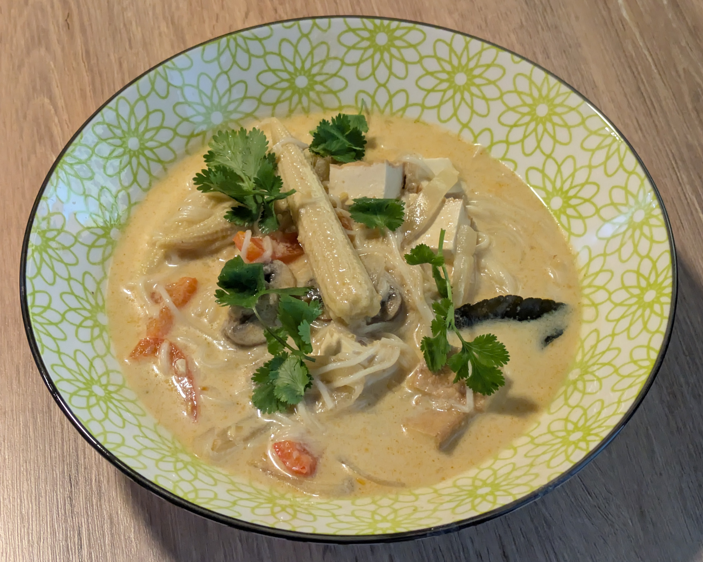

Title: Tom Kha Soup
Date: 2025-12-20
Category: Main Dishes
Tags: soup, nut-free, gluten-free

{: .image-process-article-image}

While I'll admit I don't have any cultural connection to tom kha soup, it's always been one of my favorite thai dishes. I grew up near a place that made a very tasty version, and it also helps that it's one of the more common veggie options at thai restaurants (though be careful of chicken broth!). Since my girlfriend turned out to also be a fan, I started working on my own version.

I tested out making [this version](https://zardyplants.com/recipes/vegan-tom-kha-soup-thai-inspired/) from ZardyPlants, and that was a good start. It taught me that the distinctive flavor of tom kha broth doesn't come from any one ingredient, but rather from the balance between several different ones, namely curry paste, coconut milk, lemongrass, galangal, and broth. However, that recipe still wasn't quite what I was looking for. There were too many noodles and veggies relative to the amount of broth, and the broth itself was too watery and didn't have enough flavor. 

After some experimentation, I found ways to fix those issues, including switching to coconut cream for richer coconut flavor, rebalancing the quantity of veggies and noodles, and throwing in some salt and curry powder to make the flavors really pop. Last but not least, I gave it the usual Code Delicious treatment and put all the steps in the most algorithmically optimal order. This version is much closer to the tom kha I grew up eating, and I hope you'll love it!

## Finding the Ingredients

*Most* of the stuff in this recipe is pretty standard, but there are three ingredients that can cause trouble: galangal (which is like a sort of pine flavored ginger), lime leaves, and lemongrass. You will probably have to go to an asian supermarket for those: in my experience, H-Mart carried all three, but 99 Ranch did not have lime leaves. If you can't get the lime leaves, this recipe is still good without them, so don't give up just because of that.  Also note that the galangal, lemongrass, and lime leaves can be frozen and reheated next time you make this, so you don't have to waste them even if they only sell them in large quantities.

## Yield:
About 3-4 full meals, or about 8-10 small bowls if serving as an appetizer

## Time:
~1 hour

## Ingredients:

- ~4 oz dry vermicelli noodles of choice
    - There are lots of options here, I rather like Korean japchae noodles, or you can use soumen ramen noodles

### Aromatics:
- 2 inches galangal, grated (about 2.5 tbsp tightly packed, after grating)
- 1 stalk lemongrass (or 1-2 tbsp [lemongrass paste](https://amzn.to/375PUa9))
    - To prepare a lemongrass stalk, first peel off the outer few layers until a tender, smooth surface is exposed.  Then, slice off and discard the green parts at the tops, keeping only the white and very light green parts (bottom ~6 inches). Next, slice off the roots at the base. Finally, chop the stalk into thin rings and mince those rings a few times into even smaller pieces.
    - Be sure to chop the lemongrass into tiny pieces as it will be quite tough, even after being cooked.
- 1 tbsp Thai red curry paste
- 0.5 tsp curry powder
- 3-4 cloves garlic, minced

### Stew:
- neutral oil, for frying (~1 tbsp)
- 1 white onion, sliced into half-moons
- 1 red bell pepper, sliced into ~2cm x 5mm strips
- 1 lb baby bella (cremini) mushrooms, sliced (cut large mushrooms into 4 slices and small ones in half)
- 1 can baby corn, drained and each piece cut in half
- 400 ml coconut cream
    - You can get this [online](https://www.amazon.com/Kara-Coconut-Cream-6-80-Units/dp/B00MH7UY5K?th=1) or at Asian grocery stores
- 4 cups vegan chicken broth
- 1 block firm tofu, sliced into medium (~2cm) cubes
- ~4 kaffir (aka makrut) lime leaves

### Final Ingredients:
- 6 tbsp lime juice (~2-3 medium limes)
- 1 tsp salt (you may want to add up to an additional 0.5 tsp, to taste)
- 2 tbsp white sugar (may add another tbsp or so to taste)
- Chopped cilantro for topping, about 1/2 cup loosely packed

## Directions:

1. Begin cooking the vermicelli noodles according to package directions. Once cooked, rinse with cold water to prevent further cooking and set aside.
2. Prepare everything in the **Aromatics** section and add to one prep bowl. Slice the white onion into another bowl. Chop up the bell pepper and mushrooms into a third bowl.
3. Preheat a large pot over medium heat and add some of the neutral oil. Add the aromatics and fry, stirring frequently, until fragrant (1-2 minutes). The galangal may stick to the bottom of the pan, but this is OK.
4. Next, add the sliced onion and saute for another 2 minutes, until slightly softened. Then, add the mushrooms and bell peppers. Saute for about 5 minutes, until the mushrooms are starting to soften a bit, but have not turned totally mushy yet. While this is going, you can chop up the tofu and juice the limes.
6. Now, add the baby corn, coconut cream, vegan chicken broth, and cubed tofu. Add the lime leaves as well, allowing them to float on the top of the soup like bay leaves. 
7. Bring to a simmer, then cook for ~7 more minutes.
8. Remove from heat and add the vermicelli noodles, lime juice, salt, and sugar.
9. Taste for seasoning, adding additional salt, sugar, or lime juice if necessary.
10. Serve, topping with cilantro!