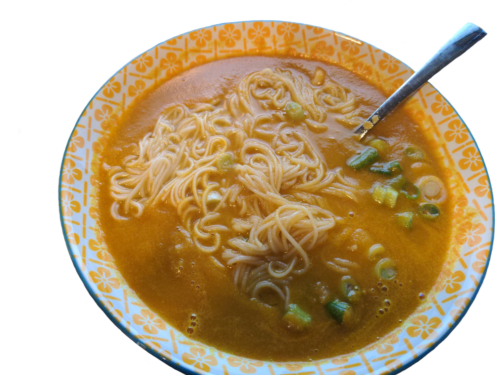

Title: Rich Veggie Potage Shoyu Ramen
Date: 2024-11-26 12:14:00
Category: Recipes

{: .image-process-article-image}

Lots of people have had the standard ramen flavors, such as miso and shoyu broth.  But have you had veggie potage?  This is a novel type of ramen which has sweet potatos and other veggies mixed into the broth. Its flavor is unique, and contains both the savory taste of shoyu and the creaminess of veggie stew. It's a whole new perspective on ramen that brings in a fillingness that other types of ramen lack.

While veggie potage is well known in Japan, it seems virtually unknown internationally.  To my knowledge, this is the first publically available English recipe for it, which I hand-translated myself after having storebought veggie potage and falling in love with it.

Original source: [https://cookpad.com/recipe/2130722](https://cookpad.com/recipe/2130722) (in Japanese) by susu58

## Yield: 
2 servings (4 cups broth)

## Ingredients:

**Broth:**

- vegetable oil (a few tbsp, for frying)
- 1 small sweet potato, peeled and coarsely chopped into ~3/4" pieces. It's easy to overload this recipe with too much sweet potato, so if yours is even medium size, don't use the entire thing!
- 1 small carrot, peeled and coarsely chopped
- 1/2 medium yellow onion, coarsely chopped
- 4 cloves garlic, sliced
- 600ml (2.5 cups) water
- 2.5 tsp [fake chicken boullion](https://www.amazon.com/Better-Than-Bouillon-Chicken-Certified/dp/B000N7YKQK)
- 1.5 tbsp Chinese light soy sauce (I recommend [Pearl River Bridge](https://www.amazon.com/Pearl-River-Bridge-Bottle-Superior/dp/B07PGWZCT6?crid=2NJOOT6Y9ZI1C&dib=eyJ2IjoiMSJ9.g2vlZTl10wZFaszcGY_sWlFMLgbwuZ9AXIBj-4nd3vJylQahbPV_1gcYBAklBH6_8o-iheDSxnpxudmKXzKHcXgwymwzxGGqqcpxjjjAx9SyfZB7w0Y9W0zEgx-zZQGKmF6Zn1CKqSbOuIQorXtJHjNdxTi57WPweNSnhnyamLHrmW49GH-jyydL9TohO6KRbqhMIuaY74xr6lSW7JXAMgFy94Ab0O1Yy1wEapmhpkmXuNDfIehIi9swtlAKbVMwFW1aZhv2Wn6Jjetqrb7ct38M3-RN_XCRm6Eo7dVCxDE.Gtv79NCpWAzLktQCxovZ5piKCUtJtrwrRK6P4cmhXGw&dib_tag=se&keywords=pearl+river+bridge+light+soy+sauce&qid=1732653233&sprefix=pearl+river+%2Caps%2C173&sr=8-2) brand #notsponsored)
- 4 tsp sake (or other cooking alcohol such as mirin or cooking sherry)

**Noodles:**

- two servings (~4oz fresh or 2.5oz dry each) ramen noodles of choice.  I recommend soumen noodles, e.g. something like [this](https://www.amazon.com/JFC-Dried-Tomoshiraga-Noodles-16-Ounce/dp/B000SIGCL0?dib=eyJ2IjoiMSJ9.S4J9I2X_XvstvlJY4e-dXwfeEMMnafUkpcduKhiwUDforrasBNlnJVIR8sEhTEBKqvpgIS_YzsngoQrNhj3572gbefTlymrvu61uks0RMsTXARyipgI6OeMQjLwk4_FM0mUxsfG2wXkfU9gxMPUUdPNIgdOamR1ESOApBHavSC56nd3X06ATzgTkPe54Ob0tFEZndhPRBLMN06ePZ1xJmseDewboZ-AqJPStTb3Gb_8gFqi_wOk6QKUueiGlkIk5UE-VdOynNNqMTV42_-KEf9lylwqJk7hffhitBDe7DeQ.vVDvTfUW40m3QrD6HvDZGvzPxKT_Nup21SmzfNUCKKc&dib_tag=se&keywords=Somen+Noodles&qid=1732653190&sr=8-4) 

**Toppings:** (suggested)

- baked tofu or fake meat of choice
- shredded or chopped green onions (2-4)
- sliced tomatoes (2 roma tomatoes)

## Directions:

1. Heat up a saucepan over medium heat and add a tablespoon or two of vegetable oil.
2. Pan fry the sweet potato, carrot, yellow onion, and garlic with the lid on. Continue until some light browning is visible on the onions and the sweet potatoes can be pierced with a fork without too much effort (though they don't need to be fully cooked). It should take about 4-5 minutes.
3. Transfer all ingredients from the pan into a blender.  Also add in the water, fake chicken boullion, soy sauce, and sake.
4. Blend until completely smooth.
5. Return mixture to the pan and simmer over medium-low heat for 5 minutes.  Be careful not to turn the heat too high and burn it!
6. While the broth is simmering, start the noodles cooking according to package directions in another pot.
8. Remove the broth from heat and pour it into a bowl.  When the noodles are ready, drain them and add to the bowl with the broth.  Mix well.
9. Add toppings as desired
